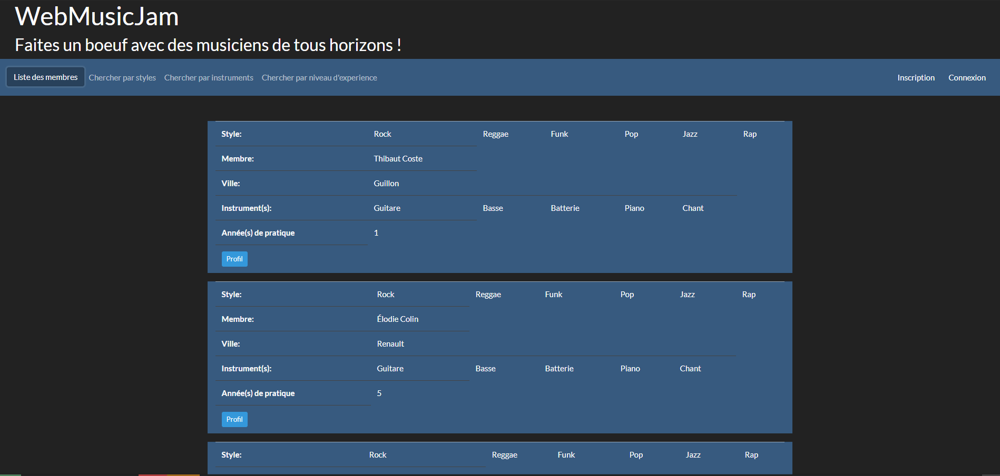

# webmusicjam
Application de regroupement de musiciens pour jouer simultanément en visioconférence.
Ce projet me permet d'apprendre à combiner Symfony, React et api-platform. Si celui arrive au bout je serai egalement ravi de l'utiliser pour jouer avec des tas de gens.
En attendant je le continue seul, on verra bien ou ça ira.

